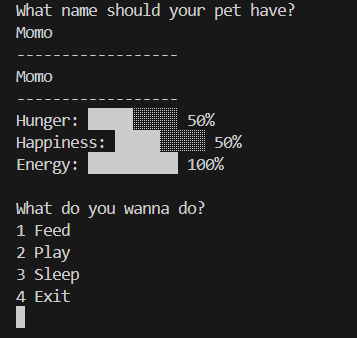
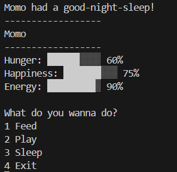

# PocketPet 🐾

A small Java-based virtual pet simulation. Created to show you my basic Java skills.

## Features

- Feed your pet
- Play games
- Manage energy and happiness
- Random events
- Save progress (TODO)

## Technologies

- Java 21
- Object-oriented programming
- File persistence

## Screenshots

## Future Improvements

- GUI with JavaFX
- Multiple pets
- Inventory system
- More Games (Mini Games?)
- Custom Clothes for pets